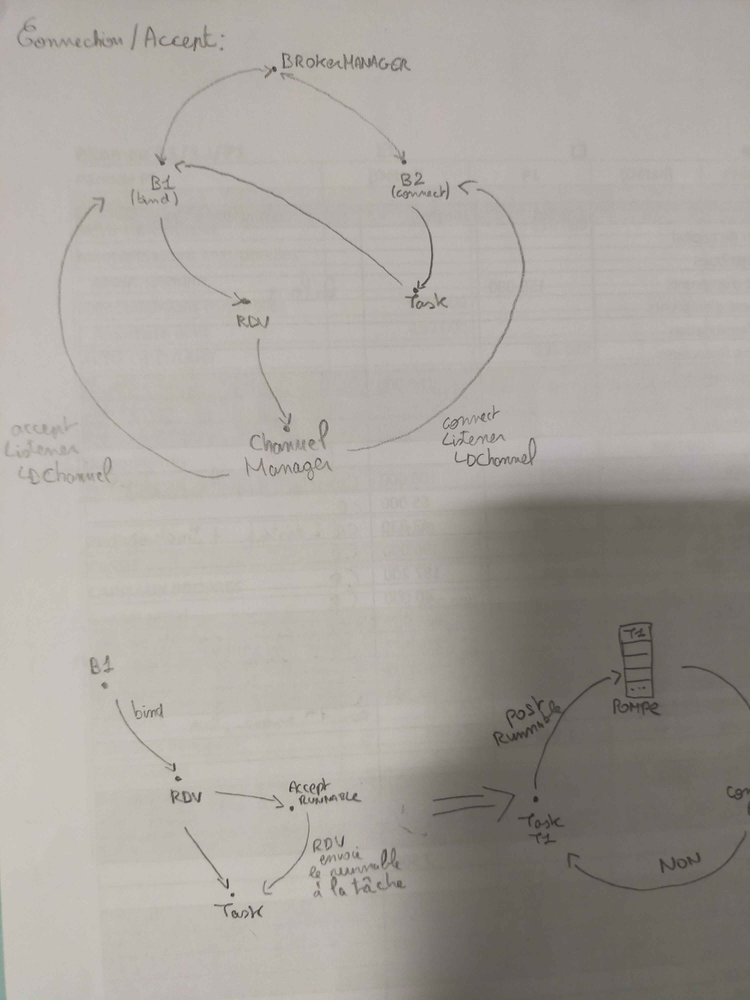
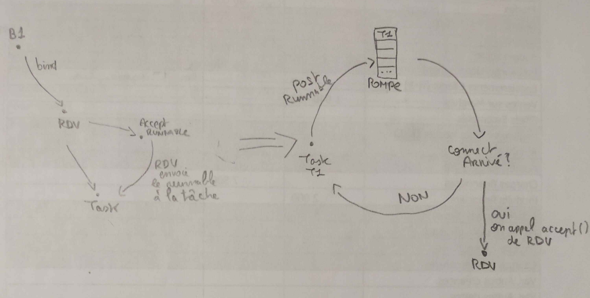
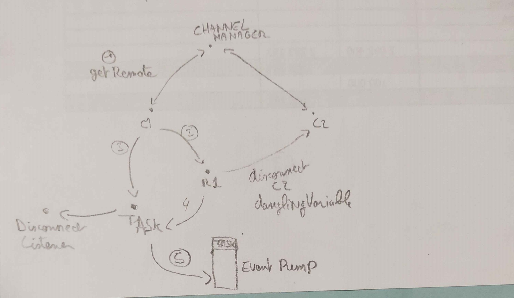

# Design

#### **Broker Manager**:
    Each Broker Manager represents a different "universe". It links a group of broker with each others.
In each broker Manager, there a broker identified by a unique id. A broker manager knows every broker in his own.
When a broker want to connect to an another, it request the broker manager with an id to identify its target and a connection
port. We can have multiple broker managers.

#### **Connection between Brokers**:

* When a broker bind a port, it create an instance of RDV object:
- RDV is waiting for a connect
- When a connect arrives, RDV initialize a ChannelManager that creates an instance of Channel for each broker.
- These channels are returned through a Listener.

* When a broker connect to a remote broker:
- A task is created and a ConnectRunnable is given to it before the task is put in the event pump.
- When the task is called by the event pump, the execution goes into the remote broker and access to the RDV instance.
- Once the execution arrives in RDV, this class enter in the connecting methods setting up the connection and the channels.
- If there is already an accepted connection, the connection is refused and refused() method of the ConnectingListener is called.

** When a connect arrives before a bind, the connection is refused. The upper level can decide what it want to do by giving a implementation of ConnectingListener**

#### **How bind event works**:

- Bind method create an instance of RDV, this instance create a specific task with an AcceptRunnable instance.
- Then, this task is put in the event pump.
- Each time, the task is called, it checks if a connect is arrived.
- If yes, RDV notify the listeners.
- If not, the task is put back in the event pump for an another loop.

#### **Channel Manager**:
Its job is to set up the in and out buffer of each channel once the connection is established.
Also, it manages the synchronization of the disconnection of the channels.

#### **Channel**:

**Writing:**
- Writing is managed by a defined task.
- When a write event is called by the event pump, it generates a Runnable.
- The number of bytes written are returned by a Listener and the latter inform the other channel that there is something to read.

**Reading:**
- The reader listener is called when there is something available to read.

#### **MessageQueue**:

- There are a listener to write and a listener to read.
- They can take two states : Managing Message length and Managing the message.
- They start with Managing the Message length and once the message length is sent, it changes its states and start sending the message.
- The messages are stored in a Queue to ensure the FIFO order.